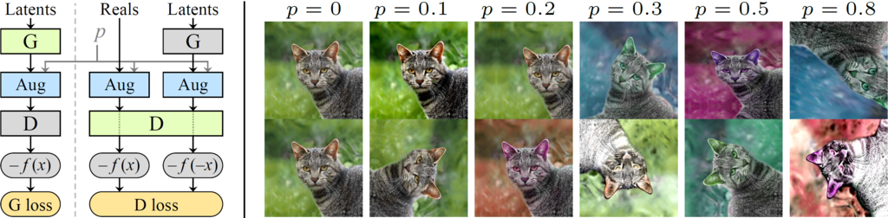
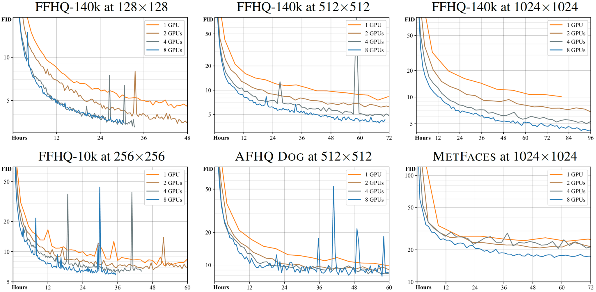

## StyleGAN2-ADA (pytorch base) &mdash; ฉบับภาษาไทย

repo นี้จะรวมถึงแค่การเทรนโมเดลเท่านั้น จะไม่รวมถึงการนำโมเดลไปใช้ หรือการปรับสไตล์ในรูป
__________________________________________________________________________________



**Training Generative Adversarial Networks with Limited Data**<br>
Tero Karras, Miika Aittala, Janne Hellsten, Samuli Laine, Jaakko Lehtinen, Timo Aila<br>
https://arxiv.org/abs/2006.06676<br>

Abstract: *Training generative adversarial networks (GAN) using too little data typically leads to discriminator overfitting, causing training to diverge. We propose an adaptive discriminator augmentation mechanism that significantly stabilizes training in limited data regimes. The approach does not require changes to loss functions or network architectures, and is applicable both when training from scratch and when fine-tuning an existing GAN on another dataset. We demonstrate, on several datasets, that good results are now possible using only a few thousand training images, often matching StyleGAN2 results with an order of magnitude fewer images. We expect this to open up new application domains for GANs. We also find that the widely used CIFAR-10 is, in fact, a limited data benchmark, and improve the record FID from 5.59 to 2.42.*

เชิงธุรกิจ โปรดเข้าเว็บไซต์นี้: [NVIDIA Research Licensing](https://www.nvidia.com/en-us/research/inquiries/)

## Data repository

| Path | Description
| :--- | :----------
| [stylegan2-ada-pytorch](https://nvlabs-fi-cdn.nvidia.com/stylegan2-ada-pytorch/) | Main directory hosted on Amazon S3
| &ensp;&ensp;&boxvr;&nbsp; [ada-paper.pdf](https://nvlabs-fi-cdn.nvidia.com/stylegan2-ada-pytorch/ada-paper.pdf) | Paper PDF
| &ensp;&ensp;&boxvr;&nbsp; [images](https://nvlabs-fi-cdn.nvidia.com/stylegan2-ada-pytorch/images/) | Curated example images produced using the pre-trained models
| &ensp;&ensp;&boxvr;&nbsp; [videos](https://nvlabs-fi-cdn.nvidia.com/stylegan2-ada-pytorch/videos/) | Curated example interpolation videos
| &ensp;&ensp;&boxur;&nbsp; [pretrained](https://nvlabs-fi-cdn.nvidia.com/stylegan2-ada-pytorch/pretrained/) | Pre-trained models
| &ensp;&ensp;&ensp;&ensp;&boxvr;&nbsp; ffhq.pkl | FFHQ at 1024x1024, trained using original StyleGAN2
| &ensp;&ensp;&ensp;&ensp;&boxvr;&nbsp; metfaces.pkl | MetFaces at 1024x1024, transfer learning from FFHQ using ADA
| &ensp;&ensp;&ensp;&ensp;&boxvr;&nbsp; afhqcat.pkl | AFHQ Cat at 512x512, trained from scratch using ADA
| &ensp;&ensp;&ensp;&ensp;&boxvr;&nbsp; afhqdog.pkl | AFHQ Dog at 512x512, trained from scratch using ADA
| &ensp;&ensp;&ensp;&ensp;&boxvr;&nbsp; afhqwild.pkl | AFHQ Wild at 512x512, trained from scratch using ADA
| &ensp;&ensp;&ensp;&ensp;&boxvr;&nbsp; cifar10.pkl | Class-conditional CIFAR-10 at 32x32
| &ensp;&ensp;&ensp;&ensp;&boxvr;&nbsp; brecahad.pkl | BreCaHAD at 512x512, trained from scratch using ADA
| &ensp;&ensp;&ensp;&ensp;&boxvr;&nbsp; [paper-fig7c-training-set-sweeps](https://nvlabs-fi-cdn.nvidia.com/stylegan2-ada-pytorch/pretrained/paper-fig7c-training-set-sweeps/) | Models used in Fig.7c (sweep over training set size)
| &ensp;&ensp;&ensp;&ensp;&boxvr;&nbsp; [paper-fig11a-small-datasets](https://nvlabs-fi-cdn.nvidia.com/stylegan2-ada-pytorch/pretrained/paper-fig11a-small-datasets/) | Models used in Fig.11a (small datasets & transfer learning)
| &ensp;&ensp;&ensp;&ensp;&boxvr;&nbsp; [paper-fig11b-cifar10](https://nvlabs-fi-cdn.nvidia.com/stylegan2-ada-pytorch/pretrained/paper-fig11b-cifar10/) | Models used in Fig.11b (CIFAR-10)
| &ensp;&ensp;&ensp;&ensp;&boxvr;&nbsp; [transfer-learning-source-nets](https://nvlabs-fi-cdn.nvidia.com/stylegan2-ada-pytorch/pretrained/transfer-learning-source-nets/) | Models used as starting point for transfer learning
| &ensp;&ensp;&ensp;&ensp;&boxur;&nbsp; [metrics](https://nvlabs-fi-cdn.nvidia.com/stylegan2-ada-pytorch/pretrained/metrics/) | Feature detectors used by the quality metrics

## ประเภท stylegan

* [stylegan2 (tensorflow base)](https://github.com/NVlabs/stylegan2)
* [stylegan2-ada (tensorflow base)](https://github.com/NVlabs/stylegan2-ada)
* [stylegan2-ada (pytorch base)](https://github.com/NVlabs/stylegan2-ada-pytorch)
* [stylegan3 (pytorch base)](https://github.com/NVlabs/stylegan3)

## Requirements

### Requirement for usage

* 64-bit Python 3.7 and PyTorch 1.7.1. See [https://pytorch.org/](https://pytorch.org/) for PyTorch install instructions.
* CUDA toolkit 11.0 or later.  Use at least version 11.1 if running on RTX 3090.  (Why is a separate CUDA toolkit installation required?  See comments in [#2](https://github.com/NVlabs/stylegan2-ada-pytorch/issues/2#issuecomment-779457121).)
* Python libraries: `pip install click requests tqdm pyspng ninja imageio-ffmpeg==0.4.3`.  
* We use the Anaconda3 2020.11 distribution which installs most of these by default.
* Docker users: use the [provided Dockerfile](./Dockerfile) to build an image with the required library dependencies.
* The code relies heavily on custom PyTorch extensions that are compiled on the fly using NVCC. On Windows, the compilation requires Microsoft Visual Studio. We recommend installing [Visual Studio Community Edition](https://visualstudio.microsoft.com/vs/) and adding it into `PATH` using `"C:\Program Files (x86)\Microsoft Visual Studio\<VERSION>\Community\VC\Auxiliary\Build\vcvars64.bat"`.

### Requirement for training model

* Linux and Windows are supported, but we recommend Linux for performance and compatibility reasons.
* 1&ndash;8 high-end NVIDIA GPUs with at least 12 GB of memory. We have done all testing and development using NVIDIA DGX-1 with 8 Tesla V100 GPUs.

## Set up

### Colab
Clone the repo
```.bash
!git clone https://github.com/NEWKNP/thai-stylegan2-ada-pytorch
```

drive to directory
```.bash
%cd thai-stylegan2-ada-pytorch
```

Install necessary library
```.bash
!pip install click requests tqdm opensimplex pyspng ninja imageio-ffmpeg==0.4.3
```

### Local with Docker
Clone the repo
```.bash
git clone https://github.com/NEWKNP/thai-stylegan2-ada-pytorch
```

drive to directory
```.bash
cd thai-stylegan2-ada-pytorch
```
build docker
```.bash
docker build --tag sg2ada:latest .
```

## การใช้งานผ่าน script file

### การ generate รูปจากโมเดล pre-trained

โมเดลที่เคยเทรน (official from NVDIA)

* [FFHQ dataset](https://github.com/NVlabs/ffhq-dataset)
* [MetFaces dataset](https://github.com/NVlabs/metfaces-dataset)
* [AFHQ dataset](https://paperswithcode.com/dataset/afhq)
* [CIFAR-10 dataset](https://www.cs.toronto.edu/~kriz/cifar.html)
* BreCaHAD dataset

```.bash
pretrained_model = 'https://nvlabs-fi-cdn.nvidia.com/stylegan2-ada-pytorch/pretrained'
ffhq_model = pretrained_model+'/ffhq.pkl'
metfaces_model = pretrained_model+'/metfaces.pkl'
afhqcat_model = pretrained_model+'/afhqcat.pkl'
afhqdog_model = pretrained_model+'/afhqdog.pkl'
afhqwild_model = pretrained_model+'/afhqwild.pkl'
cifar10_model = pretrained_model+'/cifar10.pkl'
brecahad_model = pretrained_model+'/brecahad.pkl'
```

สร้างรูปใบหน้าตาม dataset

```.bash
# directory สำหรับเก็บรูปที่ถูกสร้าง (สกุล *.png)
out_path = ''

# เบื้องต้น
python generate.py --outdir={out_path} --seeds=85,265,297,849 --network={ffhq_model}

# ปรับ truncation
python generate.py --outdir=out --trunc=0.7 \
    --network={ffhq_model}

# มีเงื่อนไข
python generate.py --outdir={out_path} --seeds=0-35 --class=1 \
    --network={cifar10_model}

# Style mixing example
python style_mixing.py --outdir={out_path} --rows=85,100,75,458,1500 --cols=55,821,1789,293 \
    --network={ffhq_model}
```

parameters   
* `--network`: 'Network pickle filename'  
* `--seeds`: 'List of random seeds'  
* `--trunc`: 'Truncation psi'  
* `--class`: 'Class label (unconditional if not specified)'  
* `--noise-mode`: 'Noise mode' option=['const', 'random', 'none']  
* `--projected-w`: 'Projection result file'  
* `--outdir`: 'Where to save the output images'  

### การใช้งานผ่าน Docker

**Docker**: You can run the above curated image example using Docker as follows:

```.bash
./docker_run.sh python3 generate.py --outdir={out_path} --seeds=85,265,297,849 --network={ffhq_model}
```

Note: The Docker image requires NVIDIA driver release `r455.23` or later.

### Legacy network

สำหรับโมเดลที่เคยเทรนผ่าน tensorflow และต้องการใช้งานผ่าน pytorch 

** ทาง official แนะนำให้เปลี่ยนเป็น pytorch base สำหรับการนำไปใช้งานในอนาคต

```.bash
python legacy.py \
    --source=https://nvlabs-fi-cdn.nvidia.com/stylegan2/networks/stylegan2-cat-config-f.pkl \
    --dest=stylegan2-cat-config-f.pkl
```

### Projecting images to latent space

การปรับรูปจริงให้เข้ากับ model โดยจะคืนค่า latent vector สำหรับปรับสไตล์ในรูป

```.bash
python projector.py --outdir={out_path} --target=~/mytargetimg.png \
    --network={ffhq_model}
```

รูปที่ใช้ ควรมีการ preprocessing (crop and align) ตาม [FFHQ dataset](https://github.com/NVlabs/ffhq-dataset) โดย command ข้างต้นจะบันทึกรูปจริง รูปที่ถูก project รวมถึง video กระบวนการ projection จากรูปจริง สู่รูปที่เข้ากับโมเดล 

## การใช้งานใน python
import library:
```.python
import math
import pickle
import torch
from tqdm import tqdm
from PIL import Image, ImageDraw
```
import our library:
```.python
import dnnlib
import legacy
```
load model:
```.python
def loadGenerator(network_pkl, seed=303):
  ''' Load trained model (file.pkl)'''
  torch.manual_seed(seed)
  print('Loading networks from "%s"...' % network_pkl)
  device = torch.device('cuda') # device = torch.device('cpu')
  # Load networks.
  with dnnlib.util.open_url(network_pkl) as fp:
      G = legacy.load_network_pkl(fp)['G_ema'].requires_grad_(False).to(device) # type: ignore
  return G

G_model = loadGenerator(ffhq_model)                                   # load generator model
```
generate data:
```.python
def generateFromW(W, G, noise_mode='random'):
  ''' Generate image from numpy array (file.npz) '''
  device = torch.device('cuda') # device = torch.device('cpu')
  if type(W) != torch.Tensor:
    W = torch.from_numpy(W).to(device)
  if W.dim() != 3:
    W = W.unsqueeze(0)
  img = G.synthesis(W, noise_mode=noise_mode)
  img = (img.permute(0, 2, 3, 1) * 127.5 + 128).clamp(0, 255).to(torch.uint8)
  img = Image.fromarray(img[0].cpu().numpy(), 'RGB')
  return img.resize((256,256))

z = torch.randn([1, G_model.z_dim]).cuda()                            # example latent codes
w = G_model.mapping(z, None, truncation_psi=0.5, truncation_cutoff=8) # mapping latent
img = generateFromW(w, G_model)                                       # generate an image
```

สามารถดูตัวอย่างเพิ่มเติมได้ใน [`generate.py`](./generate.py), [`style_mixing.py`](./style_mixing.py), and [`projector.py`](./projector.py).

## การเทรนโมเดลด้วย dataset ที่เราเตรียม

### Preparing datasets

Input: folder/zip file ที่มีรูปขนาด 1024x1024 สกุลไฟล์ png  

```.bash
# Original 1024x1024 resolution.
python dataset_tool.py --source=/your_data --dest=~/datasets/ffhq.zip

# Scaled down 256x256 resolution.
python dataset_tool.py --source=/your_data --dest=~/datasets/ffhq256x256.zip \
    --width=256 --height=256
```

parameters  
* `--source`: 'Directory or archive name for input dataset'  
    --source path/                      Recursively load all images from path/  
    --source dataset.zip                Recursively load all images from dataset.zip  
* `--dest`: 'Output directory or archive name for output dataset'  
    --dest /path/to/dir                 Save output files under /path/to/dir  
    --dest /path/to/dataset.zip         Save output files into /path/to/dataset.zip  
* `--max-images`: 'Output only up to `max-images` images'  
* `--resize-filter`: 'Filter to use when resizing images for output resolution'  option:['box', 'lanczos']  
* `--transform`: 'Input crop/resize mode' option=['center-crop', 'center-crop-wide']  
* `--width`: 'Output width'  
* `--height`: 'Output height' 

Class labels are stored in a file called 'dataset.json' that is stored at the dataset root folder.  
This file has the following structure:
```
    {
        "labels": [
            ["00000/img00000000.png",6],
            ["00000/img00000001.png",9],
            ... repeated for every image in the datase
            ["00049/img00049999.png",1]
        ]
    }
```
If the 'dataset.json' file cannot be found, the dataset is interpreted as not containing class labels.

### Training new networks
รันเพื่อเช็ค execution ว่า paramesters ที่ใส่เข้าไป มีปัญหากลางทางไหม? ก่อนรันจริง
```.bash
python train.py --outdir=~/training-runs --data=~/mydataset.zip --gpus=1 --dry-run
```
รันจริง
```.bash
python train.py --outdir=~/training-runs --data=~/mydataset.zip --gpus=1
```

In this example, the results are saved to a newly created directory `~/training-runs/<ID>-mydataset-auto1`, controlled by `--outdir`. The training exports network pickles (`network-snapshot-<INT>.pkl`) and example images (`fakes<INT>.png`) at regular intervals (controlled by `--snap`). For each pickle, it also evaluates FID (controlled by `--metrics`) and logs the resulting scores in `metric-fid50k_full.jsonl` (as well as TFEvents if TensorBoard is installed).

The name of the output directory reflects the training configuration. For example, `00000-mydataset-auto1` indicates that the *base configuration* was `auto1`, meaning that the hyperparameters were selected automatically for training on one GPU. The base configuration is controlled by `--cfg`:

| Base config           | Description
| :-------------------- | :----------
| `auto`&nbsp;(default) | Automatically select reasonable defaults based on resolution and GPU count. Serves as a good starting point for new datasets but does not necessarily lead to optimal results.
| `stylegan2`           | Reproduce results for StyleGAN2 config F at 1024x1024 using 1, 2, 4, or 8 GPUs.
| `paper256`            | Reproduce results for FFHQ and LSUN Cat at 256x256 using 1, 2, 4, or 8 GPUs.
| `paper512`            | Reproduce results for BreCaHAD and AFHQ at 512x512 using 1, 2, 4, or 8 GPUs.
| `paper1024`           | Reproduce results for MetFaces at 1024x1024 using 1, 2, 4, or 8 GPUs.
| `cifar`               | Reproduce results for CIFAR-10 (tuned configuration) using 1 or 2 GPUs.

The training configuration can be further customized with additional command line options:

* `--aug=noaug` disables ADA.
* `--cond=1` enables class-conditional training (requires a dataset with labels).
* `--mirror=1` amplifies the dataset with x-flips. Often beneficial, even with ADA.
* `--resume=ffhq1024 --snap=10` performs transfer learning from FFHQ trained at 1024x1024.
* `--resume=~/training-runs/<NAME>/network-snapshot-<INT>.pkl` resumes a previous training run.
* `--gamma=10` overrides R1 gamma. We recommend trying a couple of different values for each new dataset.
* `--aug=ada --target=0.7` adjusts ADA target value (default: 0.6).
* `--augpipe=blit` enables pixel blitting but disables all other augmentations.
* `--augpipe=bgcfnc` enables all available augmentations (blit, geom, color, filter, noise, cutout).

Please refer to [`python train.py --help`](./docs/train-help.txt) for the full list.

## Expected training time

The total training time depends heavily on resolution, number of GPUs, dataset, desired quality, and hyperparameters. The following table lists expected wallclock times to reach different points in the training, measured in thousands of real images shown to the discriminator ("kimg"):

| Resolution | GPUs | 1000 kimg | 25000 kimg | sec/kimg          | GPU mem | CPU mem
| :--------: | :--: | :-------: | :--------: | :---------------: | :-----: | :-----:
| 128x128    | 1    | 4h 05m    | 4d 06h     | 12.8&ndash;13.7   | 7.2 GB  | 3.9 GB
| 128x128    | 2    | 2h 06m    | 2d 04h     | 6.5&ndash;6.8     | 7.4 GB  | 7.9 GB
| 128x128    | 4    | 1h 20m    | 1d 09h     | 4.1&ndash;4.6     | 4.2 GB  | 16.3 GB
| 128x128    | 8    | 1h 13m    | 1d 06h     | 3.9&ndash;4.9     | 2.6 GB  | 31.9 GB
| 256x256    | 1    | 6h 36m    | 6d 21h     | 21.6&ndash;24.2   | 5.0 GB  | 4.5 GB
| 256x256    | 2    | 3h 27m    | 3d 14h     | 11.2&ndash;11.8   | 5.2 GB  | 9.0 GB
| 256x256    | 4    | 1h 45m    | 1d 20h     | 5.6&ndash;5.9     | 5.2 GB  | 17.8 GB
| 256x256    | 8    | 1h 24m    | 1d 11h     | 4.4&ndash;5.5     | 3.2 GB  | 34.7 GB
| 512x512    | 1    | 21h 03m   | 21d 22h    | 72.5&ndash;74.9   | 7.6 GB  | 5.0 GB
| 512x512    | 2    | 10h 59m   | 11d 10h    | 37.7&ndash;40.0   | 7.8 GB  | 9.8 GB
| 512x512    | 4    | 5h 29m    | 5d 17h     | 18.7&ndash;19.1   | 7.9 GB  | 17.7 GB
| 512x512    | 8    | 2h 48m    | 2d 22h     | 9.5&ndash;9.7     | 7.8 GB  | 38.2 GB
| 1024x1024  | 1    | 1d 20h    | 46d 03h    | 154.3&ndash;161.6 | 8.1 GB  | 5.3 GB
| 1024x1024  | 2    | 23h 09m   | 24d 02h    | 80.6&ndash;86.2   | 8.6 GB  | 11.9 GB
| 1024x1024  | 4    | 11h 36m   | 12d 02h    | 40.1&ndash;40.8   | 8.4 GB  | 21.9 GB
| 1024x1024  | 8    | 5h 54m    | 6d 03h     | 20.2&ndash;20.6   | 8.3 GB  | 44.7 GB

The above measurements were done using NVIDIA Tesla V100 GPUs with default settings (`--cfg=auto --aug=ada --metrics=fid50k_full`). "sec/kimg" shows the expected range of variation in raw training performance, as reported in `log.txt`. "GPU mem" and "CPU mem" show the highest observed memory consumption, excluding the peak at the beginning caused by `torch.backends.cudnn.benchmark`.

In typical cases, 25000 kimg or more is needed to reach convergence, but the results are already quite reasonable around 5000 kimg. 1000 kimg is often enough for transfer learning, which tends to converge significantly faster. The following figure shows example convergence curves for different datasets as a function of wallclock time, using the same settings as above:



Note: `--cfg=auto` serves as a reasonable first guess for the hyperparameters but it does not necessarily lead to optimal results for a given dataset. For example, `--cfg=stylegan2` yields considerably better FID  for FFHQ-140k at 1024x1024 than illustrated above. We recommend trying out at least a few different values of `--gamma` for each new dataset.

### Quality metrics

By default, `train.py` automatically computes FID for each network pickle exported during training. We recommend inspecting `metric-fid50k_full.jsonl` (or TensorBoard) at regular intervals to monitor the training progress. When desired, the automatic computation can be disabled with `--metrics=none` to speed up the training slightly (3%&ndash;9%).

Additional quality metrics can also be computed after the training:

```.bash
# Previous training run: look up options automatically, save result to JSONL file.
python calc_metrics.py --metrics=pr50k3_full \
    --network=~/training-runs/00000-ffhq10k-res64-auto1/network-snapshot-000000.pkl

# Pre-trained network pickle: specify dataset explicitly, print result to stdout.
python calc_metrics.py --metrics=fid50k_full --data=~/datasets/ffhq.zip --mirror=1 \
    --network=https://nvlabs-fi-cdn.nvidia.com/stylegan2-ada-pytorch/pretrained/ffhq.pkl
```

The first example looks up the training configuration and performs the same operation as if `--metrics=pr50k3_full` had been specified during training. The second example downloads a pre-trained network pickle, in which case the values of `--mirror` and `--data` must be specified explicitly.

Note that many of the metrics have a significant one-off cost when calculating them for the first time for a new dataset (up to 30min). Also note that the evaluation is done using a different random seed each time, so the results will vary if the same metric is computed multiple times.

We employ the following metrics in the ADA paper. Execution time and GPU memory usage is reported for one NVIDIA Tesla V100 GPU at 1024x1024 resolution:

| Metric        | Time   | GPU mem | Description |
| :-----        | :----: | :-----: | :---------- |
| `fid50k_full` | 13 min | 1.8 GB  | Fr&eacute;chet inception distance<sup>[1]</sup> against the full dataset
| `kid50k_full` | 13 min | 1.8 GB  | Kernel inception distance<sup>[2]</sup> against the full dataset
| `pr50k3_full` | 13 min | 4.1 GB  | Precision and recall<sup>[3]</sup> againt the full dataset
| `is50k`       | 13 min | 1.8 GB  | Inception score<sup>[4]</sup> for CIFAR-10

In addition, the following metrics from the [StyleGAN](https://github.com/NVlabs/stylegan) and [StyleGAN2](https://github.com/NVlabs/stylegan2) papers are also supported:

| Metric        | Time   | GPU mem | Description |
| :------------ | :----: | :-----: | :---------- |
| `fid50k`      | 13 min | 1.8 GB  | Fr&eacute;chet inception distance against 50k real images
| `kid50k`      | 13 min | 1.8 GB  | Kernel inception distance against 50k real images
| `pr50k3`      | 13 min | 4.1 GB  | Precision and recall against 50k real images
| `ppl2_wend`   | 36 min | 2.4 GB  | Perceptual path length<sup>[5]</sup> in W, endpoints, full image
| `ppl_zfull`   | 36 min | 2.4 GB  | Perceptual path length in Z, full paths, cropped image
| `ppl_wfull`   | 36 min | 2.4 GB  | Perceptual path length in W, full paths, cropped image
| `ppl_zend`    | 36 min | 2.4 GB  | Perceptual path length in Z, endpoints, cropped image
| `ppl_wend`    | 36 min | 2.4 GB  | Perceptual path length in W, endpoints, cropped image

References:
1. [GANs Trained by a Two Time-Scale Update Rule Converge to a Local Nash Equilibrium](https://arxiv.org/abs/1706.08500), Heusel et al. 2017
2. [Demystifying MMD GANs](https://arxiv.org/abs/1801.01401), Bi&nacute;kowski et al. 2018
3. [Improved Precision and Recall Metric for Assessing Generative Models](https://arxiv.org/abs/1904.06991), Kynk&auml;&auml;nniemi et al. 2019
4. [Improved Techniques for Training GANs](https://arxiv.org/abs/1606.03498), Salimans et al. 2016
5. [A Style-Based Generator Architecture for Generative Adversarial Networks](https://arxiv.org/abs/1812.04948), Karras et al. 2018

## License

Copyright &copy; 2021, NVIDIA Corporation. All rights reserved.

This work is made available under the [Nvidia Source Code License](https://nvlabs.github.io/stylegan2-ada-pytorch/license.html).

## Citation

```
@inproceedings{Karras2020ada,
  title     = {Training Generative Adversarial Networks with Limited Data},
  author    = {Tero Karras and Miika Aittala and Janne Hellsten and Samuli Laine and Jaakko Lehtinen and Timo Aila},
  booktitle = {Proc. NeurIPS},
  year      = {2020}
}
```

## Development

This is a research reference implementation and is treated as a one-time code drop. As such, we do not accept outside code contributions in the form of pull requests.

## Acknowledgements

We thank David Luebke for helpful comments; Tero Kuosmanen and Sabu Nadarajan for their support with compute infrastructure; and Edgar Sch&ouml;nfeld for guidance on setting up unconditional BigGAN.

## จุดประสงค์ของเจ้าของ repo นี้ / my propose
1. เพื่อให้ผู้ใช้ที่มีข้อจำกัดทางภาษา สามารถใช้งาน stylegan2 ในเบื้องต้นได้
2. เนื่องจากผู้เขียนมีประสบการณ์การนำ stylegan2-ada ไปประยุกต์ใช้งาน จึงอยากถ่ายทอดประสบการณ์
3. ต้องการปรับปรุง original repo ให้สามารถใช้งานได้ง่ายยิ่งขึ้น โดยได้ใส่ colab playground ไว้สำหรับใช้งาน แต่สำหรับการเทรนโมเดล อาจต้องสมัคร colab pro+
4. For English, I wish this repo will contribute in Thai language
